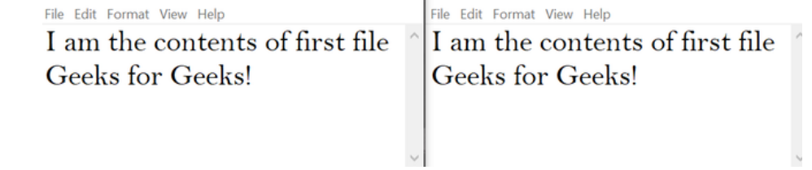

# copy-file
## AIM:
To write a python program for copying the contents from one file to another file.
## EQUIPEMENT'S REQUIRED: 
PC
Anaconda - Python 3.7
## ALGORITHM: 
### Step 1:

### Step 2: 
 
### Step 3: 

### Step 4:  

### Step 5: 

### Step 6: 

## PROGRAM:
```
with open('first.txt','r') as firstfile, open('second.txt','a') as secondfile:
    for line in firstfile:
             secondfile.write(line)

```

### OUTPUT:



## RESULT:
Thus the program is written to copy the contents from one file to another file.